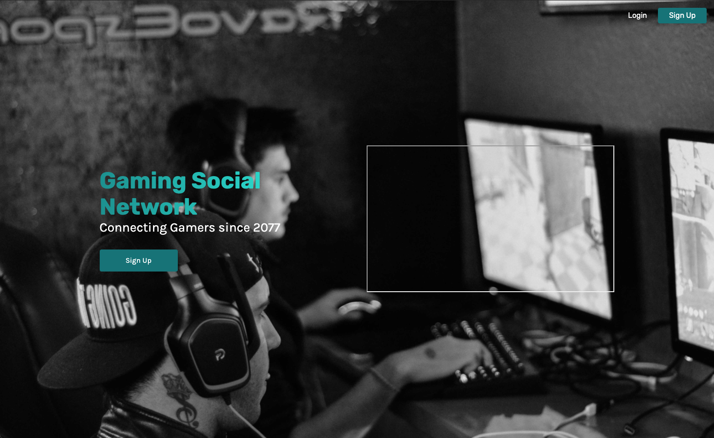
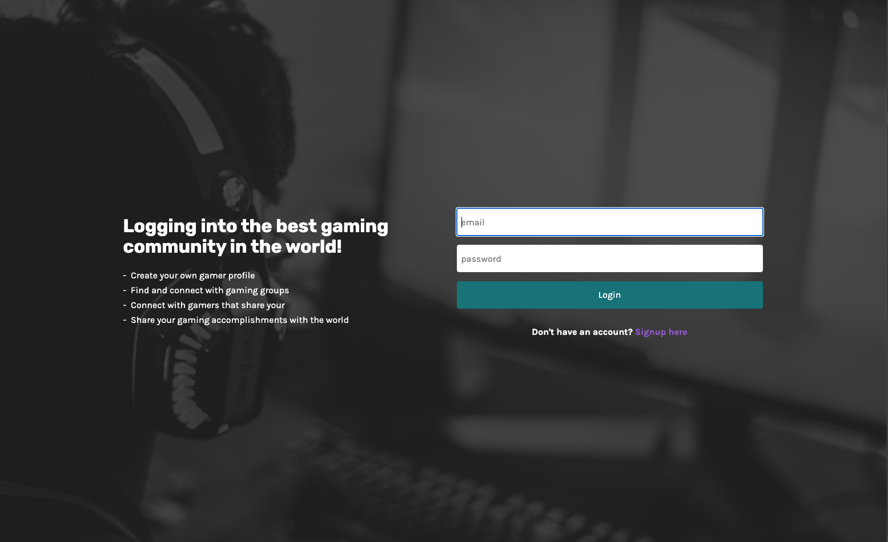
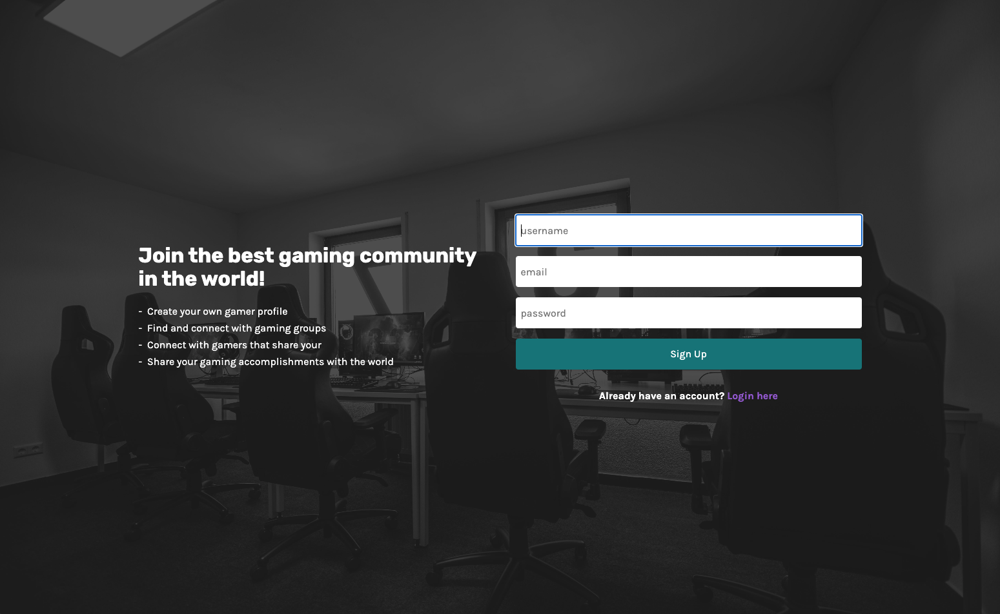
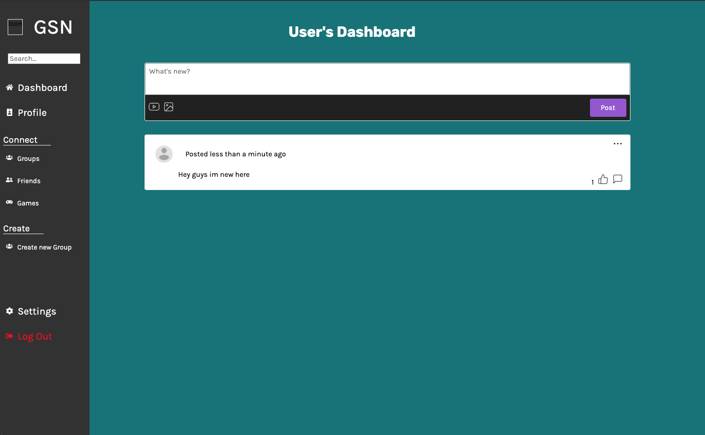
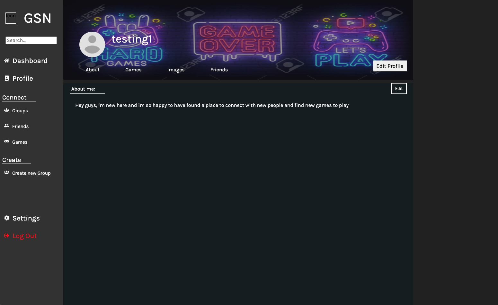
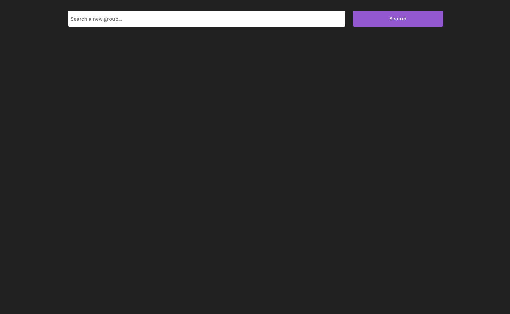
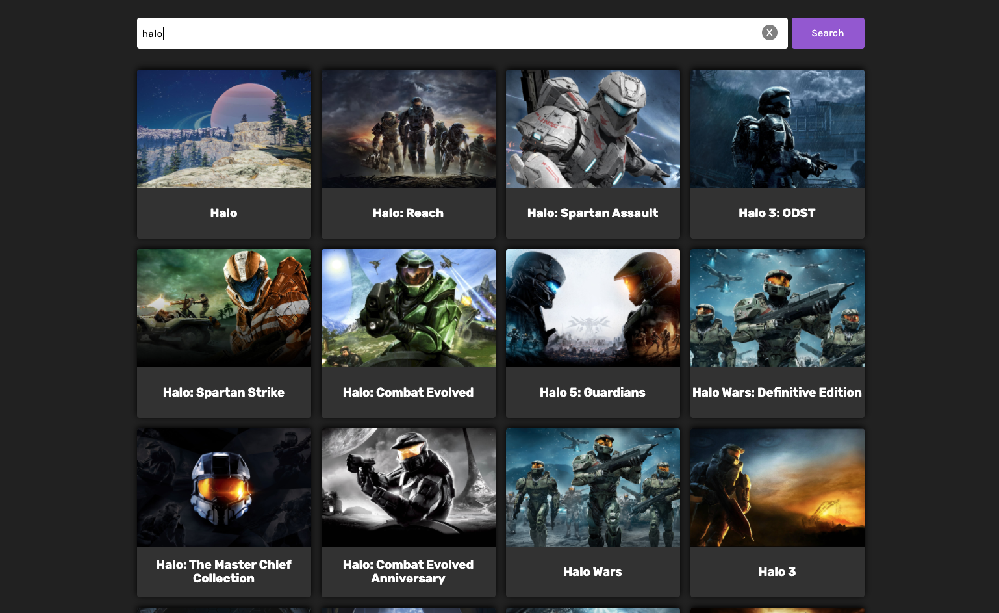

<h1>Gaming Social Network</h1>

Users are able to create a profile where they can create a bio about themselves, upload images, find new games, find new friends, and find groups to play with.

 

Users can also post their current activity and like and comment on other user's posts.

 

Users can chat in real time with other people, in groups or individual messages

 

<h1>Who uses Gaming Social Network</h1>
<ul>
<li>People who play games</li>
<li>People looking to start playing games</li>
<li>People looking for friends, groups or a place to hangout and chat with others</li>
</ul>

<h1>Routes</h1>

<h3>'/' the Landing page route</h3>
This is the first page users will land on. Where they can see a demo of our site, sign up, and log in
 

<h3>'/login' login page route && '/signup' sign up page route</h3>
This is where users can sign up or login in order to get an authenticated JWT to access the entire website, if they try access another route without an authenticated JWT they would be redirected to login page

| Login                                                                | Sign Up                                                               |
| -------------------------------------------------------------------- | --------------------------------------------------------------------- |
|  |  |

<h3>'/dashboard' the dashboard route is private route for signed up users</h3>
This is where users are directed after sign up and login. Users now have full access to finding games, friends, groups, and creating their own profile

<h3>'/:username' the profile route</h3>
This is where users can see and edit their bios, see their favorited games, upload personal images, see friend request, and find new friends

<h3>'/groups' groups route and '/games' finding games route</h3>
These routes are where users can search for new groups to join and search for new games to play and favorite

| Groups                                                                   | Games                                                                    |
| ------------------------------------------------------------------------ | ------------------------------------------------------------------------ |
|  |  |
